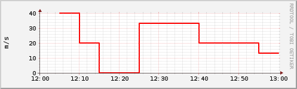
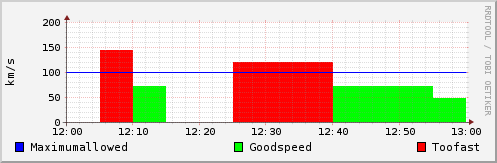

!SLIDE bullets incremental
# Was ist RRDtool? #

* Datenbank für zeitbezogene Messdaten
* Tool zum Generieren von Graphen
* Lizensiert unter der GPL

!SLIDE bullets incremental
# Daten speichern #

* *R*ound *R*obin *D*atabase
* Feste Anzahl an Datensätzen
* Alte Datensätze werden überschrieben, wenn Kapazität erreicht
* Größe der Datenbank bleibt konstant

!SLIDE commandline bullets
# Datenbank erstellen #
	$ rrdtool create speed.rrd \
		--start 920804400 \
		--step 300 \
		DS:speed:COUNTER:600:U:U \
		RRA:AVERAGE:0.5:1:24 \
		RRA:AVERAGE:0.5:6:10

!SLIDE commandline incremental
# Daten hinzufügen #

	$ rrdtool update speed.rrd 920804700:12345
	return_value = 0
	[920804700]RRA[AVERAGE][1]DS[speed] = NaN

	$ rrdtool update speed.rrd 920805000:12357
	return_value = 0
	[920805000]RRA[AVERAGE][1]DS[speed] = 4.0000000000e-02

	$ rrdtool update speed.rrd 920805300:12363
	return_value = 0
	[920805300]RRA[AVERAGE][1]DS[speed] = 2.0000000000e-02

	==> 0.04 m/s und 0.02 m/s

!SLIDE bullets incremental
# Graphen erstellen #

* Gesammelte Daten werden als Graph dargestellt
* Berechnungen können durchgeführt werden

!SLIDE transition=scrollUp center bullets
# Einfache Darstellung #

* Graph für Geschwindigkeit in m/s (Durchschnitt)

!SLIDE commandline
	$ rrdtool graph speed.png \
		--start 920804400 --end 920808000 \
		--vertical-label m/s \
		DEF:myspeed=speed.rrd:speed:AVERAGE \
		CDEF:realspeed=myspeed,1000,\* \
		LINE2:realspeed#FF0000

!SLIDE center transition=scrollUp
# Flächen mit Limit #

!SLIDE commandline
	$ rrdtool graph speed.png \
		--start 920804400 --end 920808000 \
		--vertical-label km/h \
		DEF:myspeed=speed.rrd:speed:AVERAGE \
		CDEF:kmh=myspeed,3600,\* \
		CDEF:fast=kmh,100,GT,kmh,0,IF \
		CDEF:good=kmh,100,GT,0,kmh,IF \
		HRULE:100#0000FF:"Maximum allowed" \
		AREA:good#00FF00:"Good speed" \
		AREA:fast#FF0000:"Too fast" \

!SLIDE
# Projekte die RRDtool nutzen #

### uvm. ###
